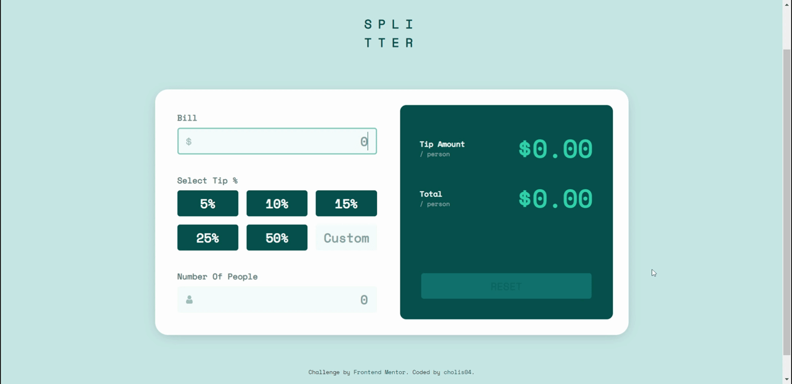
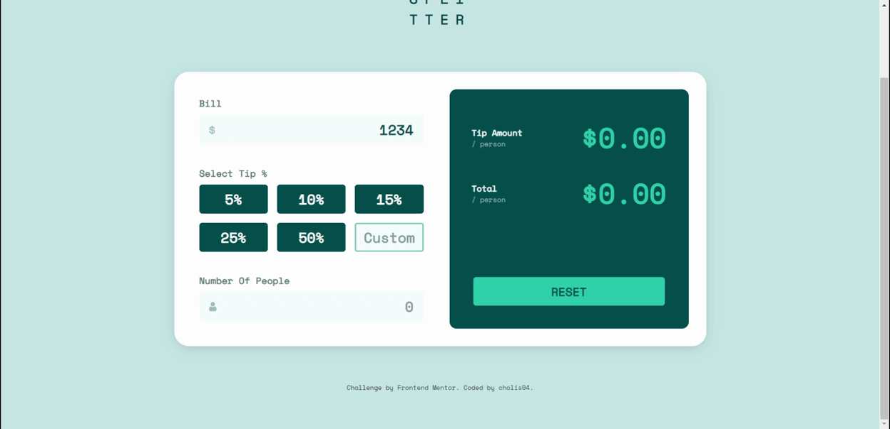
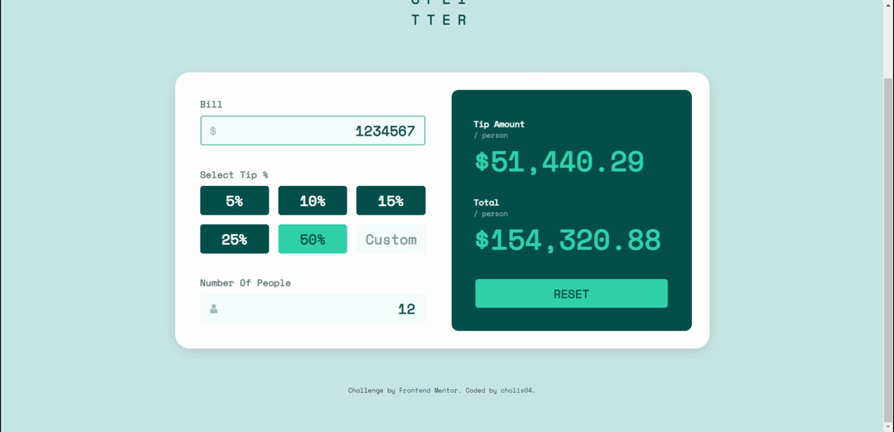

# Frontend Mentor - Tip calculator app solution

This is a solution to the [Tip calculator app challenge on Frontend Mentor](https://www.frontendmentor.io/challenges/tip-calculator-app-ugJNGbJUX). Frontend Mentor challenges help you improve your coding skills by building realistic projects.

## Table of contents

- [Overview](#overview)
  - [The challenge](#the-challenge)
  - [Screenshot](#screenshot)
  - [Links](#links)
- [My process](#my-process)
  - [Built with](#built-with)
  - [What I learned](#what-i-learned)
    - [Format Number as Currency](#format-number-as-currency)
    - [Icon inside an Input Element](#icon-inside-an-input-element)
  - [Continued development](#continued-development)
    - [Remove Leading Zero](#remove-leading-zero)
    - [Prevent characters other than numbers](#prevent-characters-other-than-numbers)
    - [Maximum Value for Tip and Number of people](#maximum-value-for-tip-and-number-of-people)
    - [Auto tick when have same value on manual tip](#auto-tick-when-have-same-value-on-manual-tip)
    - [Amount to Exponential when the result is much larger](#amount-to-exponential-when-the-result-is-much-larger)
  - [Useful resources](#useful-resources)
- [Author](#author)
- [Acknowledgments](#acknowledgments)

## Overview

### The challenge

Users should be able to:

- View the optimal layout for the app depending on their device's screen size
- See hover states for all interactive elements on the page
- Calculate the correct tip and total cost of the bill per person

### Screenshot


### Links

- Live Site URL: [https://tip-calculator-app-one-rho.vercel.app/](https://tip-calculator-app-one-rho.vercel.app/)

## My process

### Built with

- Semantic HTML5 markup
- CSS custom properties
- Flexbox
- CSS Grid
- [React](https://reactjs.org/) - JS library
- [Next.js](https://nextjs.org/) - React framework
- [Styled Components](https://styled-components.com/) - For styles
- [Fontsource](https://fontsource.org/) - Self-host Open Source fonts
- [JEST](https://jestjs.io/) - For testing

### What I learned

#### Format Number as Currency

Displays the calculation results in the form of currency. Create a currency format by using the built-in function **Intl.NumberFormat**.

```js
const formatCurrency = (amount: number) => {
  const formater = new Intl.NumberFormat('en-US', {
    style: 'currency',
    currency: 'USD',
    minimumFractionDigits: 2,
  });
  return formater.format(amount);
};
```

#### Icon inside an Input Element

Without having to add any extra elements, I gave the icon the text itself. By adding **background-image** property in css. Then set the position of the icon to match by using the **background-position** property.

```css
.input-text {
  background-image: url('./icon-dollar.svg');
  background-repeat: no-repeat;
  background-position: 0.6em 50%;

  /* Icon Area */
  padding-left: 1.8em;
}
```

### Continued development

#### Remove Leading Zero



The leading 0 has **no effect** on the calculation at all. And the number of leading 0's can sometimes be confusing. I prefer to **automatically eliminate** the number if it is in front of other numbers.

I did a pattern matching **regex** that contains leading 0. Then replace it with empty text.

```js
if (/^0+/.test(value)) {
  e.currentTarget.value = value.replace(/^0+/, '');
}
```

#### Prevent characters other than numbers

On the input element of the number type. User can enter characters like e, +, -. To avoid unwanted errors. I prevent users from doing that. I put a function on the **onKeyPress** attribute.

```js
const preventKeyPress = (e: React.KeyboardEvent<HTMLInputElement>) => {
  if (e.key === '-' || e.key === 'e' || e.key === '+' || e.key === ',') {
    e.preventDefault();
  }

  // Prevent char . on first type
  if (e.currentTarget.value === '' || e.currentTarget.valueAsNumber === 0) {
    if (e.key === '.') {
      e.preventDefault();
    }
  }
};
```

#### Maximum Value for Tip and Number of people

So that the calculations are not too many and become **infinity**, I limit the input that the user can make.

```js
<InputText max={maximum} />
```

#### Auto tick when have same value on manual tip



If the **user's custom input** has the same value as **the registered radio button**. Then the custom input will be **removed** and the Radio button having the same value will be **checked automatically**.

```js
// Empty Custom input if has a same value
const handleBlur = (e: React.FormEvent<HTMLInputElement>) => {
  const value = e.currentTarget.value;
  if (
    value === '5' ||
    value === '10' ||
    value === '15' ||
    value === '25' ||
    value === '50'
  ) {
    if (inputCustomRef.current !== null) {
      inputCustomRef.current.value = '';
    }
    setValue(id, value);
  }
};
```

#### Amount to Exponential when the result is much larger



Same as before. So that the results of the calculations are not **too long** and become **infinity** which causes the display to be damaged. So when the calculation value exceeds a certain limit it will be displayed in **exponential form**.

But the user can still see the complete calculation result on the **title** attribute.

```js
<TotalAmount title={`${titleComponent} / person : ${formatCurrency(amount)}`}>
  {amount >= 999999 ? '$' + amount.toExponential(4) : formatCurrency(amount)}
</TotalAmount>
```

### Useful resources

- [https://www.w3.org/TR/2016/WD-wai-aria-practices-1.1-20160317/examples/radio/radio.html](https://www.w3.org/TR/2016/WD-wai-aria-practices-1.1-20160317/examples/radio/radio.html)
- [https://developer.mozilla.org/en-US/docs/Web/JavaScript/Reference/Global_Objects/Intl/NumberFormat/NumberFormat](https://developer.mozilla.org/en-US/docs/Web/JavaScript/Reference/Global_Objects/Intl/NumberFormat/NumberFormat)
- [https://masteringjs.io/tutorials/fundamentals/trim-leading-zeros](https://masteringjs.io/tutorials/fundamentals/trim-leading-zeros)
- [https://www.w3schools.com/jsref/jsref_toexponential.asp](https://www.w3schools.com/jsref/jsref_toexponential.asp)

## Author

- Website - [https://cholis04.github.io](https://cholis04.github.io)
- Frontend Mentor - [@cholis04](https://www.frontendmentor.io/profile/cholis04)
- Dribbble - [cholis04](https://dribbble.com/cholis04)
- Instagram - [@cholis04](https://instagram.com/cholis04)
- Codepen - [cholis04](https://codepen.io/cholis04)

## Acknowledgments

Many thanks to anyone who provided feedback.
